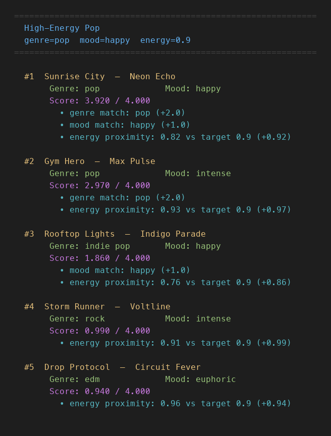
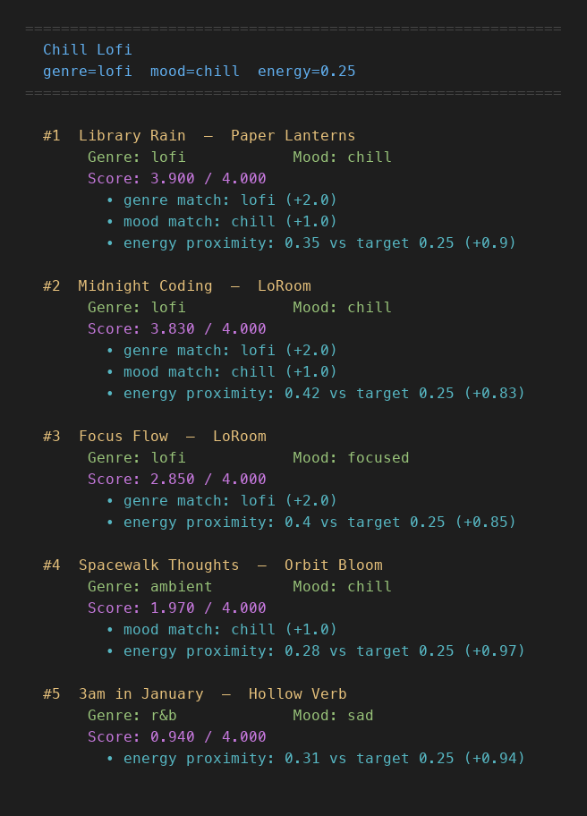
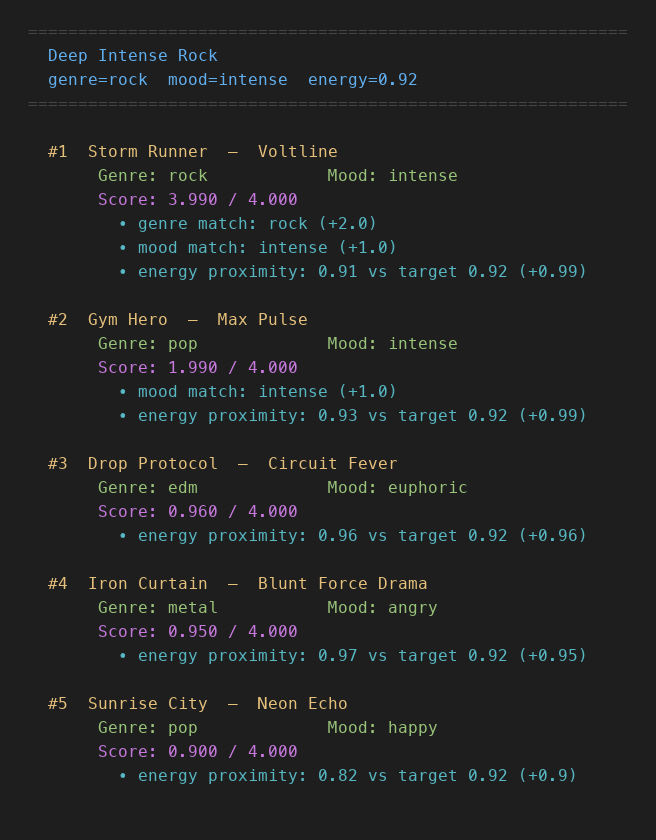
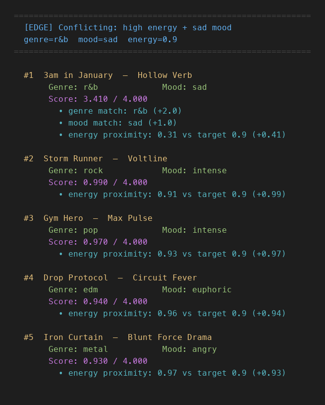
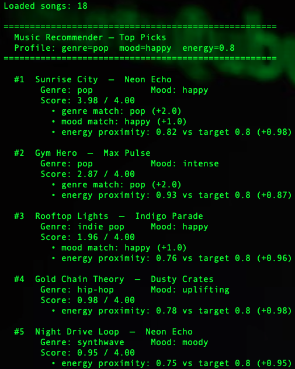

# 🎵 Music Recommender Simulation

## Project Summary

This project is a content-based music recommender that scores songs against a user's stated preferences — genre, mood, and energy level — and returns the top 5 matches from an 18-song catalog. Each song gets points for matching the user's genre (up to +1.0), mood (up to +1.0), and how close its energy is to the target (up to +2.0), for a maximum score of 4.0. The system runs seven user profiles — three realistic listener types and four adversarial edge cases — to test where the scoring logic holds up and where it breaks down. Key findings include a single-song genre filter bubble (13 of 15 genres have only one song), a silent energy dead zone between 0.46 and 0.71, and no confidence signal when a requested genre doesn't exist in the catalog at all.

---

## How The System Works

Real-world recommenders like Spotify combine collaborative filtering (learning from millions of users' behavior) with content-based filtering (analyzing the audio properties of songs themselves). This simulation focuses entirely on content-based filtering — it ignores other users and instead matches songs directly to what a single user says they want. The priority is "vibe proximity": rather than recommending the loudest or most popular track, the system rewards songs whose measurable attributes land closest to the user's stated preferences.

### `Song` features used in scoring

- `genre` — the musical category (pop, lofi, rock, ambient, jazz, synthwave, indie pop, hip-hop, r&b, classical, edm, country, metal, funk, soul)
- `mood` — the emotional label (happy, chill, intense, relaxed, focused, moody, uplifting, sad, melancholic, euphoric, nostalgic, angry, soulful, romantic)
- `energy` — a 0–1 float measuring intensity and activation level
- `valence` — a 0–1 float measuring emotional brightness (high = happy, low = dark)
- `acousticness` — a 0–1 float indicating how acoustic vs. electronic the track is
- `tempo_bpm` — beats per minute; stored for context and potential tiebreaking
- `danceability` — a 0–1 float; stored for context and potential tiebreaking

### `UserProfile` fields used in scoring

- `favorite_genre` — matched exactly against each song's genre
- `favorite_mood` — matched exactly against each song's mood
- `target_energy` — the desired energy level; songs are scored by closeness to this value
- `likes_acoustic` — boolean; grants a small bonus to high-acousticness songs when `True`

### Algorithm Recipe

Scoring is a weighted point sum applied to every song in the catalog. The song with the highest total is ranked first.

```
score(song, user) =
    2.0  × genre_match        ← +2.0 if genre matches exactly, else +0.0
  + 1.0  × mood_match         ← +1.0 if mood matches exactly, else +0.0
  + 1.0  × energy_proximity   ← +1.0 × (1 - |song.energy - user.target_energy|)

Maximum possible score: 4.0
```

After every song is scored, the list is sorted highest-to-lowest and the top `k` results (default 5) are returned alongside the score and a plain-language explanation.

**Why these weights?** Genre carries the most points (2.0) because it encodes the entire sonic world of a track — instrumentation, production style, tempo feel, and cultural context — none of which a single number can capture. Mood earns the second slot (1.0) because it crosses genre lines: a "chill" lofi track and a "chill" ambient track share a feeling even though they sound different, so mood alone should not override genre. Energy proximity fills the remaining point as the strongest continuous signal; it differentiates songs within the same genre and mood without requiring an exact match.

### Expected Biases

- **Genre dominance.** A 2.0-point genre bonus means two genre mismatches can never be overcome by a perfect mood and energy match combined. A great song in a related-but-different genre (e.g., ambient when the user asked for lofi) will always score lower than a mediocre same-genre track. This is the right tradeoff for a small catalog but would be too rigid at scale.
- **Exact-match brittleness.** Genre and mood are compared as plain strings. "Indie pop" and "pop" share obvious overlap but score zero genre points against each other. A user who loves "hip-hop" would get no genre credit for a "funk" song, even though the groove and rhythm feel are closely related.
- **Valence blindness.** Two songs with identical genre, mood, and energy scores can differ dramatically in emotional tone — one bright and uplifting, one dark and melancholic — and the recipe cannot tell them apart. Adding a valence similarity term would fix this.

---

## Getting Started

### Setup

1. Create a virtual environment (optional but recommended):

   ```bash
   python -m venv .venv
   source .venv/bin/activate      # Mac or Linux
   .venv\Scripts\activate         # Windows

2. Install dependencies

```bash
pip install -r requirements.txt
```

3. Run the app:

```bash
python -m src.main
```

### Running Tests

Run the starter tests with:

```bash
pytest
```

You can add more tests in `tests/test_recommender.py`.

---

## Terminal Output — Profile Screenshots

The screenshots below were generated by running `python -m src.main` against all
seven user profiles.  Each image is rendered directly from the recommender's
printed output.

### Standard Profiles

#### High-Energy Pop
`genre=pop · mood=happy · energy=0.9`



---

#### Chill Lofi
`genre=lofi · mood=chill · energy=0.25`



---

#### Deep Intense Rock
`genre=rock · mood=intense · energy=0.92`



---

### Adversarial / Edge-Case Profiles

These profiles are designed to probe scoring weaknesses — conflicting signals,
missing genres, and extreme energy values.

#### Edge Case 1 — Conflicting: high energy + sad mood
`genre=r&b · mood=sad · energy=0.9`
The sad, low-energy r&b track wins on genre+mood (3.0 pts) even though its
energy (0.31) is far from the 0.9 target.  All runner-up slots fill with
high-energy songs from unrelated genres — the "sad" signal vanishes after rank 1.



---

#### Edge Case 2 — Ghost genre (no catalog match)
`genre=bossa nova · mood=relaxed · energy=0.5`
No song in the catalog earns genre points.  The maximum achievable score drops
to ~1.87, yet the system returns results with no indication of low confidence.


---

#### Edge Case 3 — Neutral energy, no dominant genre
`genre=ambient · mood=focused · energy=0.5`
The single ambient track wins on genre alone (2.0 pts) despite missing the
requested "focused" mood.  A lofi track with the right mood scores lower because
the genre bonus outweighs a mood match.


---

#### Edge Case 4 — Quiet angry (energy=0.05, mood=angry)
`genre=metal · mood=angry · energy=0.05`
Iron Curtain wins decisively (genre + mood = 3.0 pts) but earns only +0.08 on
energy because the loudest metal track in the catalog (0.97) is at the opposite
end of the scale.  Positions 2–5 are all quiet ambient/lofi songs — a metal fan
asking for "quiet" gets a classical-and-ambient playlist as runners-up.


---

## Experiments You Tried

Use this section to document the experiments you ran. For example:

- What happened when you changed the weight on genre from 2.0 to 0.5
- What happened when you added tempo or valence to the score
- How did your system behave for different types of users

---

## Limitations and Risks

Summarize some limitations of your recommender.

Examples:

- It only works on a tiny catalog
- It does not understand lyrics or language
- It might over favor one genre or mood

You will go deeper on this in your model card.

---

## Reflection

Read and complete `model_card.md`:

[**Model Card**](model_card.md)

Write 1 to 2 paragraphs here about what you learned:

- about how recommenders turn data into predictions
- about where bias or unfairness could show up in systems like this


---

## 7. `model_card_template.md`

Combines reflection and model card framing from the Module 3 guidance. :contentReference[oaicite:2]{index=2}  

```markdown
# 🎧 Model Card - Music Recommender Simulation

## 1. Model Name

Give your recommender a name, for example:

> VibeFinder 1.0

---

## 2. Intended Use

- What is this system trying to do
- Who is it for

Example:

> This model suggests 3 to 5 songs from a small catalog based on a user's preferred genre, mood, and energy level. It is for classroom exploration only, not for real users.

---

## 3. How It Works (Short Explanation)

Describe your scoring logic in plain language.

- What features of each song does it consider
- What information about the user does it use
- How does it turn those into a number

Try to avoid code in this section, treat it like an explanation to a non programmer.

---

## 4. Data

Describe your dataset.

- How many songs are in `data/songs.csv`
- Did you add or remove any songs
- What kinds of genres or moods are represented
- Whose taste does this data mostly reflect

---

## 5. Strengths

Where does your recommender work well

You can think about:
- Situations where the top results "felt right"
- Particular user profiles it served well
- Simplicity or transparency benefits

---

## 6. Limitations and Bias

Where does your recommender struggle

Some prompts:
- Does it ignore some genres or moods
- Does it treat all users as if they have the same taste shape
- Is it biased toward high energy or one genre by default
- How could this be unfair if used in a real product

---

## 7. Evaluation

How did you check your system

Examples:
- You tried multiple user profiles and wrote down whether the results matched your expectations
- You compared your simulation to what a real app like Spotify or YouTube tends to recommend
- You wrote tests for your scoring logic

You do not need a numeric metric, but if you used one, explain what it measures.

---

## 8. Future Work

If you had more time, how would you improve this recommender

Examples:

- Add support for multiple users and "group vibe" recommendations
- Balance diversity of songs instead of always picking the closest match
- Use more features, like tempo ranges or lyric themes

---

## 9. Personal Reflection

A few sentences about what you learned:

- What surprised you about how your system behaved
- How did building this change how you think about real music recommenders
- Where do you think human judgment still matters, even if the model seems "smart"



