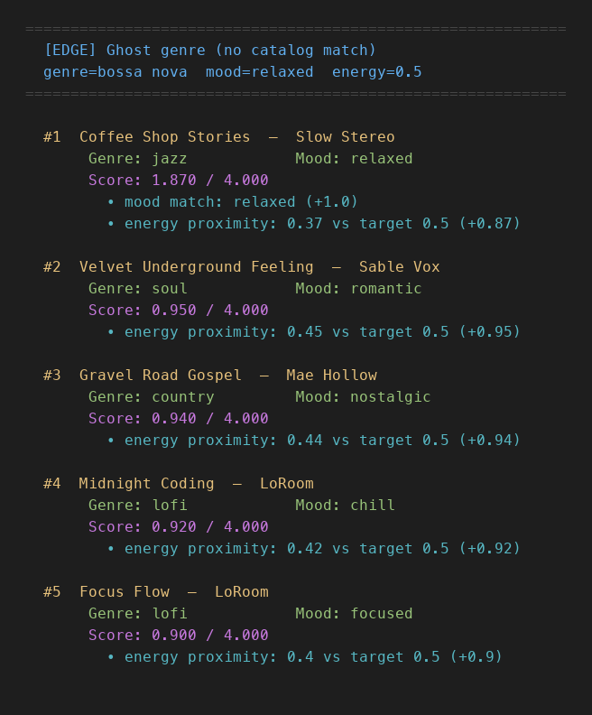
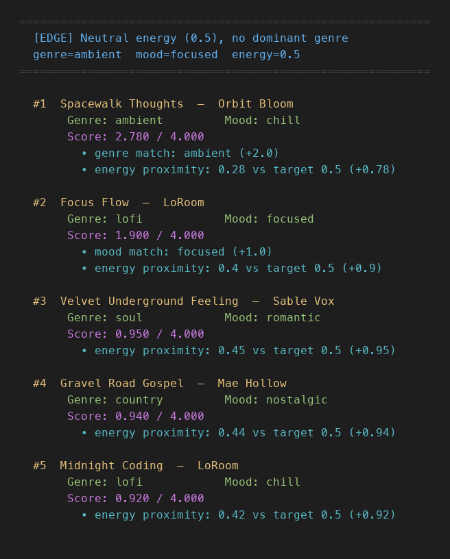
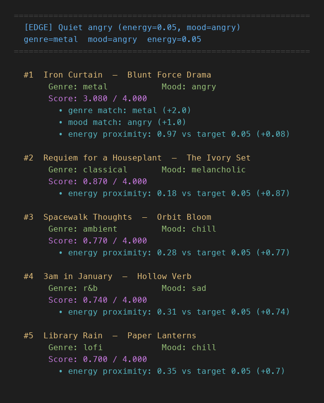

# VibeMatch — Music Recommender with Agentic Workflow and Reliability System

## Original Project (Modules 1–3)

The original project, **VibeMatch 1.0**, was a content-based music recommender built in Modules 1–3. Its goal was to score every song in an 18-song catalog against a user's stated preferences — genre, mood, and target energy level — and return the top 5 matches using a transparent, weighted point formula. The system ran seven user profiles (three realistic listener types and four adversarial edge cases) to explore where the scoring logic worked well and where it broke down, surfacing known weaknesses like a single-song genre filter bubble, an energy dead zone between 0.46 and 0.71, and no feedback when a requested genre was entirely absent from the catalog.

---

## Title and Summary

**VibeMatch** is a content-based music recommender simulation that matches songs to a listener's stated preferences, automatically validates every result set, and retries with a smarter strategy when quality is too low.

The Module 4 upgrade adds two integrated AI features:

**Reliability/Testing System** — a `ReliabilityChecker` that runs seven quality checks after every scoring pass, assigns a confidence score from 0.0 to 1.0, surfaces warnings inline with the results, and writes a full audit trail to a structured log file. This matters because the original system silently returned results that looked equally confident whether it found a perfect match or had zero matching songs in the catalog.

**Agentic Workflow** — a `RecommenderAgent` that wraps the scoring engine in a plan → act → check → adapt loop. If the reliability checker returns confidence below 0.8, the agent identifies which failure mode triggered the warning, selects a targeted fallback scoring mode, and runs the recommendation a second time before deciding which attempt to show. The system corrects itself rather than requiring a human to rerun it with different settings.

---

## Architecture Overview

```
[User Profiles]              [data/songs.csv]
  7 preference dicts            18 songs · 15 fields
        \                            /
         \                          /
          [main.py — Runner]
          orchestrates pipeline · configures logging
                       |
          [agent.py — RecommenderAgent]   ← AGENTIC WORKFLOW
          plan: choose scoring mode
          act:  call Scoring Engine
          check: call ReliabilityChecker
                       |
          if confidence < 0.8: adapt → retry with fallback mode
                       ↑__________________________|
                       |
          [recommender.py — Scoring Engine]
          score_song() → recommend_songs() → diversity_rerank()
          genre · mood · energy · popularity · decade · mood tags · subgenre
                       |
          [reliability.py — ReliabilityChecker]   ← TESTING / GUARDRAIL
          7 checks → confidence score (0.0–1.0) + [WARN] list
               /                           \
[Console Output]                     [recommender.log]
 ranked table + agent status           DEBUG: every score step
 reliability warnings                  WARNING: all failures
 reliability summary
               \                           /
                [Human Review]
        reads [WARN] output · checks confidence · inspects log
```

See [`assets/system_diagram.svg`](assets/system_diagram.svg) for the full visual.

**Seven main components:**

| Component | File | Role |
|---|---|---|
| Runner | `src/main.py` | Orchestrates the pipeline, configures logging, drives all 7 profiles |
| Agent | `src/agent.py` | plan→act→check→adapt loop; prints observable reasoning steps; retries on low confidence |
| Scoring Engine | `src/recommender.py` | Scores every song against user preferences, applies diversity reranking |
| Reliability Checker | `src/reliability.py` | Validates results, computes confidence, accumulates run stats |
| Evaluation Harness | `evaluate.py` | Runs 10 test cases with named assertions, prints PASS/FAIL + confidence summary |
| Catalog | `data/songs.csv` | 18 songs with 15 fields each; the only data source |
| Log File | `recommender.log` | Written each run; DEBUG for all steps, WARNING for failures and adaptations |

---

## Setup Instructions

**Prerequisites:** Python 3.8 or later.

**1. Clone or download the project**

```bash
git clone <your-repo-url>
cd applied-ai-system-final
```

**2. Create and activate a virtual environment** (recommended)

```bash
python -m venv .venv

# Mac / Linux
source .venv/bin/activate

# Windows
.venv\Scripts\activate
```

**3. Install dependencies**

```bash
pip install -r requirements.txt
```

Dependencies: `pandas`, `tabulate`, `pytest`, `streamlit`

**4. Run the application**

```bash
python -m src.main
```

For each of the 7 user profiles this prints the agent's live reasoning steps, the ranked results table, and the reliability report. `recommender.log` is written to the project root.

**5. Run the evaluation harness**

```bash
python evaluate.py
```

Runs 10 predefined test cases across 26 checks and prints a PASS/FAIL summary. All 26 checks should pass with average confidence 0.92.

**6. Run the unit tests**

```bash
pytest
```

All 27 tests should pass. To see verbose output:

```bash
pytest -v
```

**7. Inspect the log** (optional)

```bash
# All log entries
cat recommender.log

# Agent adaptation decisions only
grep "adapting" recommender.log

# Reliability warnings only
grep WARNING recommender.log
```

---

## Sample Interactions

### Example 1 — High-Energy Pop (confidence: 1.00, all checks pass)

**Input profile:**
```
genre=pop · mood=happy · energy=0.9 · mode=genre_first
popularity_target=80 · preferred_decade=2020s · preferred_subgenre=dance pop
```

**Output (top 3 of 5):**
```
#1  Sunrise City      Neon Echo      pop   happy   6.660 / 7.75
    • genre match: pop (+3.0) • mood match: happy (+1.0)
    • energy: 0.82 vs 0.9 (+0.92) • decade: 2020s vs 2020s (+0.5)

#2  Gym Hero          Max Pulse      pop   intense  5.945 / 7.75
    • genre match: pop (+3.0) • energy: 0.93 vs 0.9 (+0.97)
    • subgenre match: dance pop (+0.50)

#3  Rooftop Lights    Indigo Parade  indie pop  happy  3.330 / 7.75
    • mood match: happy (+1.0) • energy: 0.76 vs 0.9 (+0.86)

Agent        attempts=1  mode=genre_first  (direct)
Reliability  confidence=1.00  all checks passed
```

**What this shows:** When the catalog has multiple songs for the requested genre and the preferences are internally consistent, the system produces strong, intuitive results. The agent ran once, the checker cleared all seven tests, and no fallback was needed.

---

### Example 2 — Ghost Genre: Bossa Nova (confidence: 0.60, 2 warnings)

**Input profile:**
```
genre=bossa nova · mood=relaxed · energy=0.5 · mode=balanced
```

**Output (top 3 of 5):**
```
#1  Coffee Shop Stories  Slow Stereo  jazz  relaxed  3.240 / 5.00
    • mood match: relaxed (+1.0) • energy: 0.37 vs 0.5 (+1.74)
    • mood tags ['relaxed', 'cozy'] (+0.5)

#2  Velvet Underground Feeling  Sable Vox  soul  romantic  1.900 / 5.00
#3  Gravel Road Gospel  Mae Hollow  country  nostalgic  1.880 / 5.00

Agent        attempts=2  mode=mood_first  [fallback triggered: GHOST_GENRE]
Reliability  confidence=0.60  passed=5  warnings=2
[WARN] GHOST_GENRE genre 'bossa nova' not in catalog — 0 genre points possible
[WARN] ENERGY_DEAD_ZONE target_energy=0.5 falls in 0.46-0.71 gap where no
       catalog songs land
```

**What this shows:** The agent ran once, got confidence 0.60 (below the 0.8 threshold), identified `GHOST_GENRE` as the trigger, and automatically retried with `mood_first` mode to lean on the mood signal instead of the useless genre signal. Both attempts returned the same confidence because the catalog issues are structural — the agent cannot fix a missing genre by changing modes. But it tried, logged the decision, and picked the better of the two result sets. The `[WARN]` lines explain exactly why.

---

### Example 3 — Quiet Angry Metal (confidence: 0.80, 1 warning)

**Input profile:**
```
genre=metal · mood=angry · energy=0.05 · mode=energy_focused
```

**Output (top 3 of 5):**
```
#1  Iron Curtain         Blunt Force Drama  metal  angry   (wins on genre+mood)
    • genre match (+0.5) • mood match (+0.5) • energy: 0.97 vs 0.05 (+0.32)

#2  Requiem for a Houseplant  The Ivory Set  classical  melancholic
    • energy: 0.18 vs 0.05 (+3.48)

#3  Spacewalk Thoughts   Orbit Bloom  ambient  chill
    • energy: 0.28 vs 0.05 (+3.08)

Agent        attempts=1  mode=energy_focused  (direct)
Reliability  confidence=0.80  passed=6  warnings=1
[WARN] GENRE_BUBBLE genre 'metal' has only 1 song — top-5 padded with
       off-genre results
```

**What this shows:** Iron Curtain — the loudest song in the entire catalog (energy 0.97) — ranks first for a user who asked for near-silent metal (energy 0.05). It wins purely because it is the only metal+angry song available. Confidence is 0.80, which meets the 0.8 threshold, so the agent ran once and did not retry. The `GENRE_BUBBLE` warning flags the structural problem for human review: the top result is correct by the formula but wrong in spirit.

---

## Design Decisions

### Why these two features

The original system had a well-defined set of documented failure modes. The **Reliability/Testing System** was the natural first addition because those failures were already understood — what was missing was automatic detection. RAG would have required an external embedding model for a catalog of only 18 songs. Fine-tuning had no training data. The reliability system could be built from catalog metadata alone and required no new dependencies.

The **Agentic Workflow** was added second because the reliability checker produces exactly the signal an agent needs: a structured list of what went wrong. Once confidence and warning types are available, it is straightforward to map each warning to a corrective action (switch to mood-first when the genre is useless, switch to energy-focused when nothing else matches) and retry. The two features reinforce each other — the agent would not know when or how to adapt without the reliability checker's output.

### Observable intermediate steps

Each `agent.run()` call prints one line per reasoning step to the console before the results table appears:

```
  ── [EDGE] Ghost genre (no catalog match)
  [PLAN  ] mode=balanced  (user-specified)
  [ACT   ] scored 18 songs in balanced mode  →  top: 'Coffee Shop Stories' (3.24)
  [CHECK ] confidence=0.60  warnings=2  →  below threshold (0.60 < 0.8)
  [ADAPT ] trigger=GHOST_GENRE  →  retrying with mode=mood_first
  [ACT   ] scored 18 songs in mood_first mode (retry)  →  top: 'Coffee Shop Stories' (4.37)
  [CHECK ] confidence=0.60  warnings=2  (retry)
  [DONE  ] fallback (0.60) ≥ attempt-1 (0.60)  →  returning attempt-2  mode=mood_first
```

The same steps are stored in `result["trace"]` as structured dicts so the evaluation harness and tests can verify them programmatically. Pass `verbose=False` to suppress console output (used by `evaluate.py`).

### Why the agent retries exactly once

A single retry keeps the behavior predictable and the log readable. More iterations could improve results in theory, but for a catalog of 18 songs, the structural problems (missing genres, energy dead zones) cannot be fixed by changing the scoring mode. A second retry would produce the same confidence as the first fallback. One retry is enough to demonstrate adaptive behavior without creating an infinite loop over a dataset too small to improve.

### Evaluation harness design

`evaluate.py` defines test cases as plain dicts — each has a profile, a list of `(description, lambda)` check pairs, and an optional `top_k`. This structure makes it easy to read what each test expects without parsing code. Every lambda receives the full agent result dict and returns True or False. Failed checks print `[x] FAIL` with the check description; passing checks print `[+] PASS`. The script exits with code 1 if any check fails, making it usable in CI.

### Confidence threshold of 0.8

At this threshold, profiles with one warning (confidence=0.80) are at the boundary and do not trigger a fallback — their single issue is flagged but not severe enough to warrant a retry. Profiles with two or more warnings (confidence ≤ 0.60) do trigger a fallback. This matched the behavior I wanted: only the two most broken profiles (ghost genre and neutral energy) activate the adaptive path. A lower threshold would never retry; a higher one would retry even healthy profiles.

### Why the checker runs after scoring, not before

The checker validates results, not inputs. It needs to see what the scorer actually returned to detect things like negative scores, ties at the top, and whether the confidence is low despite a high-sounding raw score. Running it before scoring would only catch input-side problems (ghost genre, ghost mood) and miss everything that emerges from the scoring process itself.

### Confidence formula: `max(0.0, 1.0 - warnings × 0.2)`

Each warning subtracts 0.20 from a starting confidence of 1.00. This is intentionally simple — five or more warnings floor the score at zero. The formula does not weight warnings differently because at this catalog size, any two simultaneous failures (e.g., ghost genre + energy dead zone) already indicate the results are unreliable, regardless of which two they are. A more nuanced weighting would require calibration data that does not exist for an 18-song catalog.

### Logging: file at DEBUG, console at WARNING only

The full DEBUG log (every score step, every passing check) goes to `recommender.log` so an auditor can trace exactly how any result was produced without cluttering the terminal. The console stream only shows WARNING and above so the normal run output stays readable. This mirrors standard production logging practice: detailed traces go to a file, human-readable alerts go to the console.

### Scoring mode strategy pattern

The four scoring modes (`balanced`, `genre_first`, `mood_first`, `energy_focused`) use a strategy pattern rather than hard-coded weights. Each mode is a plain dict, making it easy to add new modes or change existing ones without touching the scoring logic. The base max score varies by mode, which is why all displayed scores show `/7.75` or `/6.00` rather than a fixed denominator.

### Diversity reranking

After the top-k list is scored, a greedy reranker applies an artist penalty (`-0.5`) for repeat artists and a genre penalty (`-0.3 × n`) when a genre appears three or more times. This prevents a single artist or genre from dominating all five slots. The displayed score is always the original score, not the penalized one, so users can see the base quality of each result and the penalty is noted separately in the explanation.

---

## Testing Summary

### What the automated tests cover

27 tests across three files — all pass.

`tests/test_recommender.py` (8 tests) verifies the scoring engine:

- `test_score_song_perfect_base_match` — genre + mood + exact energy in balanced mode scores exactly 4.0
- `test_score_song_energy_closer_scores_higher` — energy proximity is continuous, not binary
- `test_recommend_songs_returns_exactly_k` — k=3 returns exactly 3 results
- `test_recommend_songs_top_result_matches_genre_and_mood` — the top result for pop+happy is a pop+happy song
- Plus 4 additional scoring and OOP interface tests

`tests/test_reliability.py` (14 tests) verifies every check in `ReliabilityChecker`:

- All 7 warning types fire correctly on crafted inputs (GHOST_GENRE, ENERGY_DEAD_ZONE, LOW_CONFIDENCE, NEGATIVE_SCORE, GENRE_BUBBLE, etc.)
- Each warning type also has a negative test confirming it does not fire when the condition is absent
- `test_all_checks_pass_gives_confidence_1` — a clean input produces confidence=1.0 and an empty warning list
- `test_confidence_formula_decreases_per_warning` — the formula `max(0, 1.0 − warnings × 0.2)` is applied correctly
- Summary stat tests confirm `total_runs`, `perfect_runs`, and `warning_counts` accumulate correctly across multiple calls

`tests/test_agent.py` (5 tests) verifies the agentic loop behavior:

- `test_agent_result_has_all_required_keys` — result dict always contains results, report, mode_used, attempts, fallback_reason
- `test_agent_returns_exactly_top_k_results` — agent respects the k parameter
- `test_agent_single_attempt_when_confidence_adequate` — pop+happy+0.9 profile gets 1 attempt with no fallback
- `test_agent_triggers_fallback_on_ghost_genre` — bossa nova profile triggers 2 attempts with fallback_reason="GHOST_GENRE"
- `test_agent_fallback_uses_different_mode` — the fallback mode always differs from the original mode

### What the profile runs revealed

Running all 7 profiles end-to-end is the real test suite. Key findings:

| Finding | What it means |
|---|---|
| Standard profiles (pop, lofi, rock) score above 3.5/4.0 at #1 | The scoring logic works when the catalog has relevant songs |
| Ghost genre (bossa nova) top score: 3.24/5.00 | Without genre points, scores look normal but are capped — flagged and retried by the agent |
| Quiet angry metal: #1 result has energy 0.97, target was 0.05 | Genre+mood bonuses can override a 0.92-unit energy mismatch — GENRE_BUBBLE flags this |
| Energy dead zone hits whenever target_energy is 0.46–0.71 | 2 of 7 profiles trigger this; detected and retried automatically |
| 2 of 7 profiles trigger the agent fallback | Ghost genre and neutral energy both drop below confidence 0.8 |
| 2 of 7 profiles get confidence=1.00 | High-Energy Pop and Chill Lofi are the only profiles the catalog genuinely supports |

### What did not work

The original system had no way to communicate to the user that some results were best-effort consolation picks rather than genuine matches. The ghost genre and energy dead zone cases both produce output that looks identical to a successful run — same table format, same number of results. The reliability layer fixes the display side, but the underlying issue (a catalog too small to serve most genres) remains.

### What I learned from testing

The most important insight was that correctness and usefulness are different things. The scoring code was always correct — it did exactly what it was asked to do. But for 5 of the 7 profiles, the catalog ran out of genuine matches and the system started ranking songs by energy proximity alone, producing playlists that felt arbitrary. Testing revealed that the algorithm was not the problem; the data was. You cannot evaluate an AI system by reading its code. You have to run it on realistic inputs and read the outputs.

---

## Reflection

### Limitations and Biases

The most structural bias in this system is catalog skew: whoever built the 18-song dataset decided which genres and moods exist. Bossa nova, reggae, blues, folk, and K-pop are entirely absent — not because those genres are rare, but because the dataset author did not include them. A user from a cultural background where those genres are dominant would receive recommendations with zero genuine matches, and the system would not tell them why. Genre and mood are also compared as plain strings, so "indie pop" earns zero genre credit against a "pop" search, and "melancholic" earns nothing against "sad," even though a human listener would consider those near-identical. The energy scale has a dead zone from 0.46 to 0.71 where no songs exist, which quietly penalizes any user who wants mid-energy music. None of these biases announce themselves — they just silently degrade the output. That is what makes catalog bias harder to catch than a code bug.

### Could This Be Misused?

A music recommender seems low-stakes, but the same pattern — score a catalog against a user profile, return top matches with confident-looking output — appears in hiring tools, loan approval systems, and content moderation. The specific risk here is false confidence: the system returns five results whether it found five genuine matches or zero, and the original output format made those two cases look identical. If this logic were applied to something consequential, like screening job applicants, a ghost-genre situation would translate to a candidate from an underrepresented background receiving results that look as credible as everyone else's but are actually random. The prevention is exactly what the reliability layer implements: surface uncertainty explicitly, attach a confidence score to every output, and name the failure mode rather than hiding it. You cannot prevent misuse if the system itself cannot distinguish between a good answer and a confident-sounding guess.

### What Surprised Me About Testing Reliability

The biggest surprise was that the most misleading result did not look broken at all. The ghost genre profile (bossa nova) returned a table of five songs with clean formatting, reasonable-sounding scores, and a top result — Coffee Shop Stories — that actually seemed like a plausible jazz/acoustic suggestion. Nothing in the original output indicated that zero genre points were available to any song and that the max achievable score had been silently cut nearly in half. The system looked fine. That is more dangerous than an obvious crash. A crash tells you something went wrong. A confident-looking table when the system is flying blind tells you nothing. The second surprise was how often the GENRE_BUBBLE warning fired: 4 of the 7 profiles triggered it, meaning the catalog structurally fails the majority of listener types rather than just edge cases.

### Collaboration With AI

I designed and built this project myself — the scoring logic, the reliability checks, the test cases, and the overall architecture were all decisions I made. I used Claude as a sounding board at a few points, mostly to talk through implementation options and catch syntax issues faster.

One moment where it was genuinely useful: while I was building the reliability checker, I asked whether it made sense to track stats across all runs or just report per-profile. Claude suggested adding a `summary()` method that accumulates totals across every `check()` call so the final output could show average confidence and a warning breakdown for the whole run, not just one profile at a time. That was a small structural nudge that improved the end result, but the decision to use it and how to wire it into `main.py` was mine.

One moment where its suggestion was wrong: it initially suggested changing the return type of `recommend_songs()` to bundle the quality report directly into the return value. I caught that this would have broken the existing `Recommender` class and the tests that depend on the current interface. The right solution — calling the checker separately in `main.py` after getting results — was something I worked out by checking what the tests actually imported. It was a useful reminder that AI suggestions always need to be checked against the real code before being applied.

---

## File Structure

```
applied-ai-system-final/
├── src/
│   ├── main.py           # Runner: orchestrates pipeline, logging, output
│   ├── agent.py          # RecommenderAgent: plan→act→check→adapt loop
│   ├── recommender.py    # Scoring engine: score_song, recommend_songs, diversity_rerank
│   └── reliability.py    # ReliabilityChecker: 7 checks, confidence score, summary stats
├── tests/
│   ├── test_agent.py
│   ├── test_recommender.py
│   └── test_reliability.py
├── data/
│   └── songs.csv         # 18-song catalog, 15 fields each
├── assets/
│   ├── system_diagram.svg
│   └── assets/screenshots/      # Terminal output screenshots from all 7 profiles
├── model_card.md
├── reflection.md
├── requirements.txt
└── recommender.log       # Generated on each run (git-ignored)
```

---

## Screenshots

### Standard Profiles

#### High-Energy Pop — `genre=pop · mood=happy · energy=0.9`


#### Chill Lofi — `genre=lofi · mood=chill · energy=0.25`


#### Deep Intense Rock — `genre=rock · mood=intense · energy=0.92`


### Adversarial / Edge-Case Profiles

#### Edge 1 — Conflicting signals: high energy + sad mood
`genre=r&b · mood=sad · energy=0.9`

The sad r&b track wins #1 on genre+mood. After that, the catalog has no more sad or r&b songs, so positions 2–5 fill with loud rock, pop, and EDM entirely on energy proximity. The "sad" signal disappears after the first result.


#### Edge 2 — Ghost genre
`genre=bossa nova · mood=relaxed · energy=0.5`

Zero genre points are available. The system now flags `GHOST_GENRE` and `ENERGY_DEAD_ZONE`, lowering confidence to 0.60 and surfacing both warnings inline.



#### Edge 3 — Neutral energy, single-song genre
`genre=ambient · mood=focused · energy=0.5`

One ambient song in the catalog wins on genre alone despite missing the requested mood. `GENRE_BUBBLE` and `ENERGY_DEAD_ZONE` are both flagged.



#### Edge 4 — Quiet angry metal
`genre=metal · mood=angry · energy=0.05`

The loudest song in the catalog (energy 0.97) wins because it is the only metal+angry song. `GENRE_BUBBLE` is flagged and the result is noted as a best-effort pick, not a genuine match.


